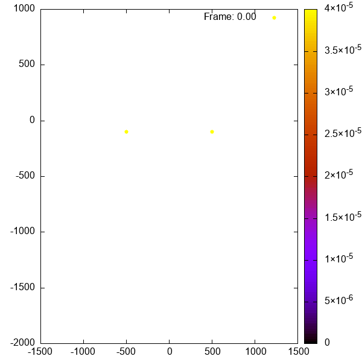

DISCLAIMER:

The results of our code have no been tested against any real world data and should not be interpreted as such


<h1> Overview of SoundPropogationUnderwater </h1>

<h2> Introduction </h2>

SoundPropagationUnderwater is a RUST project designed by Abigail Marshall, Dan Gelder, Emily Murray, Jack Murdoch, Roxanne Langton and Thomas Otter to simulate the propagation of sound waves underwater in a closed bodied system.

<h3> Features <h3>

- Sample Text
- Sample Text

<h2> Installation </h2>

<h3> Downloading prerequisites </h3>

Before you import the library to code, ensure you have downloaded the most recent versions of Git Bash and GnuPlot for your OS.

To download Git Bash, click here --> [Git Bash Download](https://git-scm.com/downloads) <br>
To download GnuPlot, click here --> [GnuPlot Download](https://sourceforge.net/projects/gnuplot/files/gnuplot/) <br>

When installing GnuPlot, ensure that you enable '**Add application directory to your PATH environment variable**' under **Additional Tasks**.

<h3> Importing SoundPropogationUnderwater </h3>

After installing the prerequisites, you can now add the repository as a dependency to your code in the terminal, as shown below:

<!DOCTYPE html>
<html lang="en">
<head>
<meta charset="UTF-8">
<meta name="viewport" content="width=device-width, initial-scale=1.0">
<title>Copy Button for Fenced Code Blocks</title>
<style>
/* Style for the copy button */
.copy-button {
    background-color: #4CAF50;
    color: white;
    padding: 5px 10px;
    border: none;
    border-radius: 4px;
    cursor: pointer;
    float: right;
}
</style>
</head>
<body>

<script>
// JavaScript function to copy text to clipboard
function copyText(text) {
    // Create a textarea element
    var textarea = document.createElement("textarea");
    // Set its value to the text that needs to be copied
    textarea.value = text;
    // Append the textarea to the body
    document.body.appendChild(textarea);
    // Select the text in the textarea
    textarea.select();
    // Copy the selected text to clipboard
    document.execCommand("copy");
    // Remove the textarea from the body
    document.body.removeChild(textarea);
}
</script>

<!-- Example fenced code block with copy button -->
```bash
cargo add SoundProp --git https://github.com/TomOtter/SoundPropogationUnderwater/tree/main/SoundProp
```
<button class="copy-button" onclick="copyText(this.previousElementSibling.innerText)">Copy</button>
</pre>

</body>
</html>

<br>

<h2> Creating your simulation </h2>

<h2> Example simulation </h2>

<!DOCTYPE html>
<html lang="en">
<head>
<meta charset="UTF-8">
<meta name="viewport" content="width=device-width, initial-scale=1.0">
<title>Copy Button for Fenced Code Blocks</title>
<style>
/* Style for the copy button */
.copy-button {
    background-color: #4CAF50;
    color: white;
    padding: 5px 10px;
    border: none;
    border-radius: 4px;
    cursor: pointer;
    float: right;
}
</style>
</head>
<body>

<script>
// JavaScript function to copy text to clipboard
function copyText(text) {
    // Create a textarea element
    var textarea = document.createElement("textarea");
    // Set its value to the text that needs to be copied
    textarea.value = text;
    // Append the textarea to the body
    document.body.appendChild(textarea);
    // Select the text in the textarea
    textarea.select();
    // Copy the selected text to clipboard
    document.execCommand("copy");
    // Remove the textarea from the body
    document.body.removeChild(textarea);
}
</script>

<!-- Example fenced code block with copy button -->
```rust
fn main() -> std::io::Result<()> {

    let mut sound_prop: Simulation = Simulation::initialise(5.0, [-1500.0,1500.0], [-2000.0,1000.0]);
    sound_prop.add_source(-PI, PI, 240, 1.0,
         20.0, [-500.0, -100.0], Point);
    sound_prop.add_source(-PI, PI, 240, 1.0,
         10.0, [500.0, -100.0], Point);
    sound_prop.gif(2.0, 0.005, 100);

    Ok(())
    
}
```
<button class="copy-button" onclick="copyText(this.previousElementSibling.innerText)">Copy</button>
</pre>

</body>
</html>

<br>

This example creates two point sound sources, both 500 m away from the centre of the water body and 100 m deep, with the intensity of the sound waves at each source being 1 A / m<sup>2</sup>. 240 sound waves are then created at each source, with their initial angle of propagation having an even separation between +/- PI across all waves at the source. At the first source, the frequency of the outputted sound waves is 20.0 Hz whereas the second outputs waves with a frequency of 10.0 Hz.

The rays are propagated outwards from these sources for 2.0 s and their components are updated every 0.005 s. The data is then outputted across 100 different files, showing the rays positions and intensities every 0.02 s, and as a gif.

The simulation is contained between +/- 1500.0 in the x-axis and between 1000.0 and -2000.0 in the y-axis. Data points are also set to interact if they are within squares of size 5.0 in both height and width.

<h3> Output</h3>




