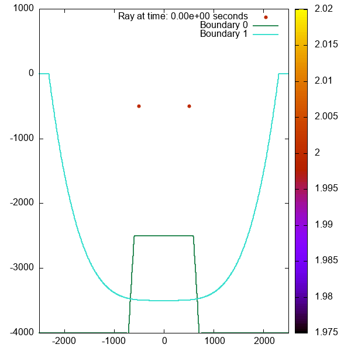

<h1> Overview of SoundPropogationUnderwater </h1>

<h2> Introduction </h2>

SoundPropogationUnderwater is a RUST project designed by Abigail Marshall, Dan Gelder, Emily Murray, Jack Murdoch, Roxanne Langton and Thomas Otter to simulate the propagation of sound waves underwater in a closed bodied system. Our objective with this library is to provide fast and precise open-source modeling software, offering extensive built-in customization options to tailor simulations to individual needs but is also easily expansive.

### Key Features

- **Multiple Sound Sources:** SoundPropogationUnderwater allows for multiple point sources to be simulated simultaneously, which can be used to integrate noise sources alongside your primary sound source.
- **Customisable Boundary Conditions:** Customise your boundary in your simulation by defining your own boundary shape, by inputting your own function and limits, and using one of our in-built material types.
- **Accurate Ray Interference:** Rays in close proximity of each other will interfere, for any number of rays with all possible phase differences, altering their outputted intensity.
- **Precision Boundary Detection:** No matter the time-step set, rays propagating in the simulation will automatically update their conditions whenever they reach a new boundary, increasing the accuracy of their pathing.
- **Data Output:** The positions of the rays and their relative intensities at a given time-step is outputted into a .txt file in its own folder 'outputdata' in the directory. The amount of data files created is definable and the times at which they are created are evenly separated across the simulation length.
- **GIF Generation** Using the data provided in the .txt files, the library also utilises GnuPlot to produce a gif of the sound wave propagation, making the simulation easier to visualise.

<h2> Installation </h2>

<h3> Downloading prerequisites </h3>

Before you import the library to code, ensure you have downloaded the most recent versions of Git Bash and GnuPlot for your OS. Git Bash is required to connect to GitHub repositories and GnuPlot is required to produce any GIF's from the outputted data files.

To download Git Bash, click here --> [Git Bash Download](https://git-scm.com/downloads) <br>
To download GnuPlot, click here --> [GnuPlot Download](https://sourceforge.net/projects/gnuplot/files/gnuplot/) <br>

When installing GnuPlot, ensure that you enable '**Add application directory to your PATH environment variable**' under **Additional Tasks**.

<h3> Importing SoundPropogationUnderwater </h3>

After installing the prerequisites, you can now add the repository as a dependency to your code by inputting the following into your terminal:

```bash
cargo add SoundProp --git https://github.com/TomOtter/SoundPropogationUnderwater/tree/main
```

<h2> Creating your simulation </h2>

The first step in creating your own simulation requires you to define a mutable variable to store all of the simulation data using the Simulation::new function. This function takes 3 variables: square_size, simulation_x_range and simulation_y_range.

```Rust
let mut my_simulation = Simulation::new(
    square_size,            // f64
    simulation_x_range,     // [f64;2]
    simulation_y_range,     // [f64;2]
);
```

- **square_size:** Defines the size of the squares within the grid. This value must be positive and non-zero.
- **simulation_x_range:** Defines the limits of the simulation across the x-axis. The limits inside the array must be in order of increasing magnitude.
- **simulation_y_range:** Defines the limits of the simulation across the y-axis. The limits inside the array must be in order of increasing magnitude.

When outputting data, the rays are appended into a grid of squares, between the limits defined in simulation_x_range and simulation_y_range, with a size of square_size. Because of this a larger square_size results in the rays being more seinsitive to interference, so we recommend trying to keep this value small with respect to the simulation size to maintain accuracy.

<h3> Defining boundaries </h3>

To set your simulation boundaries, you should use Simulation::add_boundary. This function requires you to input a boundary material type and your own function of x to set the shape of your boundary.

```Rust

let shape_function: fn(f64) -> f64 = // ...

my_simulation.add_boundary(
    material_type,          // MaterialType
    shape_function,         // dyn fn
);
```

Our library comes with a large selection of MaterialTypes, such as: 

- **Stone Materials:** Basalt, Granite, Quartzite, Gneiss, Schist, Marble, Limestone, Shale, Sandstone
- **Other Materials:** TurbiditeArea, SiliceousSediment, CalcerousSediment, Sand

To write your function, you must first specify that it is of type fn(f64) -> f64 and then your singular input parameter |x: f64| followed by an expression. For a boundary shape of y = x<sup>2</sup>, you would lay it out as: |x: f64| x.powi(2).

It is also possible to customise the limits of your previously set boundary. The initial boundary definition sets the boundary to have a maximum y position of 0.0 m and it has no limits in the x-axis. You can overwrite these limits using:

```Rust
my_simulation.x_limits(
    limits,                 // [f64;2]
);

my_simulation.y_upper_limit(
    limit,                  // f64
);
```

<h3> Adding sound wave sources </h3>

To define any sound wave sources present within the simulation, you can use Simulation::add_source. Calling this function multiple times, for the same simulation, will not overwrite the previous sources, allowing for rays to propagate from multiple sources simultaneously. Besides the variable holding all simulation data, the function takes 7 inputs: start_angle, end_angle, number_of_rays, intensity, frequency, location and source_type and should be called as shown below.

```rust
my_simulation.add_source(
    start_angle,        // f64
    end_angle,          // f64
    number_of_rays,     // i32
    intensity,          // f64
    frequency,          // f64
    location,           // [f64;2]
    source_type,        // SourceType
);
```

- **start_angle** and **end_angle:** These are both f64 inputs, between &plusmn; &pi;, that define the limits of the angles at which rays propagate between, going anticlockwise. Inside of this range, the initial angles of the rays are evenly distributed. It is important to note that start_angle does not necessarily need to be smaller than end_angle.
- **number_of_rays:** Defines the number of rays that will propagate outwards from the source. This must be a positive, non-zero, integer value.
- **intensity:** A positive, non-zero, variable which defines the total intensity at the source, not the individual intensities of the rays.
- **frequency:** A positive, non-zero, variable that defines the frequency of all rays propagating from the given source.
- **location:** An array of 2 float variables, whos magnitudes represent the x and y positions of the centre of the source respectively.
- **source_type:** An enumeration of all the source types our simulation can create. Currently we only produce a 'Point' source (where all sound waves will propagate from a single point) however it is setup this way to allow for more source types to easily be introduced to the code.

<h3> Running the simulation and Outputting the Result </h3>

There are two options you have when outputting the results of our simulation. Both involve outputting data files, containing each rays position and intensities, at different time steps however you can also output a gif in addition to this.

To output only raw data files, you can call the Simulation::generate_data_files function. Besides the variable holding all simulation data, the function takes 3 inputs: duration, dt and number_of_files.

```rust
my_simulation.generate_data_files(
    duration,       // f64
    dt,             // f64
    number_of_files // i32
);
```

- **duration:** A positive, non-zero, variable that represents the total simulation time
- **dt:** A positive, non-zero, variable that represents the time increment. This should not be greater than duration.
- **number_of_files:** A positive, non-zero, integer that determines how many data files are outputted. This should not be greater than duration / dt.

To also create a GIF, you must call the Simulation::generate_gif function. Besides the variable holding all simulation data, the function takes 3 inputs: duration, dt and frames.

```rust
my_simulation.generate_gif(
    duration,       // f64
    dt,             // f64
    frames,         // i32
);
```

- **duration:** A positive, non-zero, variable that represents the total simulation time
- **dt:** A positive, non-zero, variable that represents the time increment. This should not be greater than duration.
- **frames:** A positive, non-zero, integer that determines how many data files are outputted and the number of frames present in the GIF. This should not be greater than duration / dt.

<h2> Example simulation </h2>

```rust
mod material;
mod ray_trace;

use {
    material::MaterialType::*,
    ray_trace::{Simulation, SourceType::*},
    std::time,
};


pub const PI: f64 = 3.14159265358979323846264338327950288_f64;

fn main() -> std::io::Result<()> {
    use std::time::Instant;
    let now = Instant::now();
    let boundary1: fn(f64) -> f64 = |x| -1.0 * (x / 10.0).powi(2) + 1000.0;
    let boundary2: fn(f64) -> f64 = |x| (x / 300.0).powi(4) - 3500.0;

    let mut sound_prop = Simulation::new(0.75, [-2500.0,2500.0], [-4000.0,1000.0]);

    sound_prop.add_boundary(Sand, boundary1);
    sound_prop.y_upper_limit(-2500.0);
    sound_prop.x_limits([-750.0, 750.0]);

    sound_prop.add_boundary(TurbiditeArea, boundary2);

    sound_prop.add_source(-PI, PI, 2000, 4.0,
        10.0, [-500.0, -100.0], Point);
    sound_prop.add_source(-PI, PI, 2000, 2.0,
        10.0, [500.0, -100.0], Point);

   sound_prop.generate_gif(5.0, 0.005, 500);

   let elapsed = now.elapsed();
    println!("Elapsed: {:.2?}", elapsed);
    Ok(())
    
}
```

This example creates a simulation with a granite (Boundary 0) & turbidite area (Boundary 1) boundary as well as two point sound sources, both 500 m away from the centre of the water body and 100 m deep, with the intensity of the sound waves at each source being 2 A / m<sup>2</sup>. 1000 sound waves are then created at each source, with their initial angle of propagation having an even separation between &plusmn; &pi; across all waves at the source. At the first source, the frequency of the outputted sound waves is 20.0 Hz whereas the second outputs waves with a frequency of 10.0 Hz.

The rays are propagated outwards from these sources for 2.0 s and their components are updated every 0.005 s. The data is then outputted across 100 different files, showing the rays positions and intensities every 0.02 s, and as a gif.

The simulation is contained between &plusmn; 1500.0 in the x-axis and between 1000.0 and -2000.0 in the y-axis. Data points are also set to interact if they are within squares of size 5.0 in both height and width.

<h3> Output</h3>

